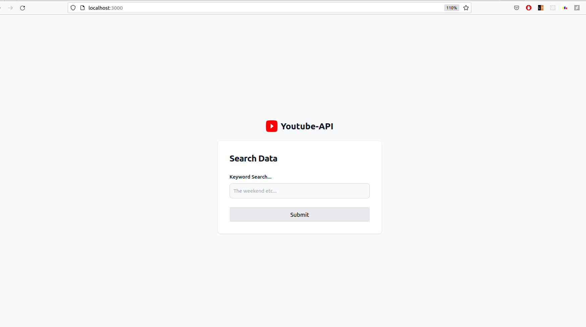
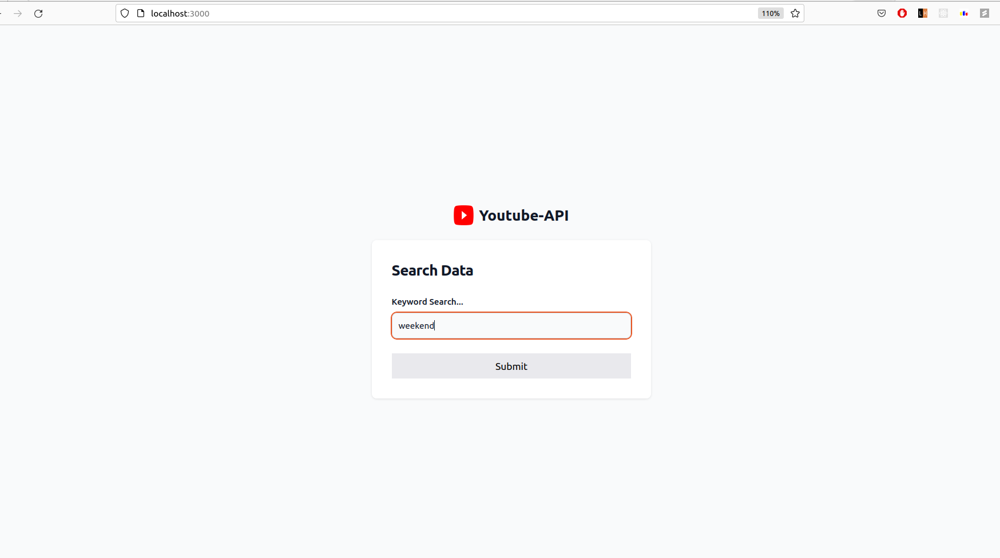
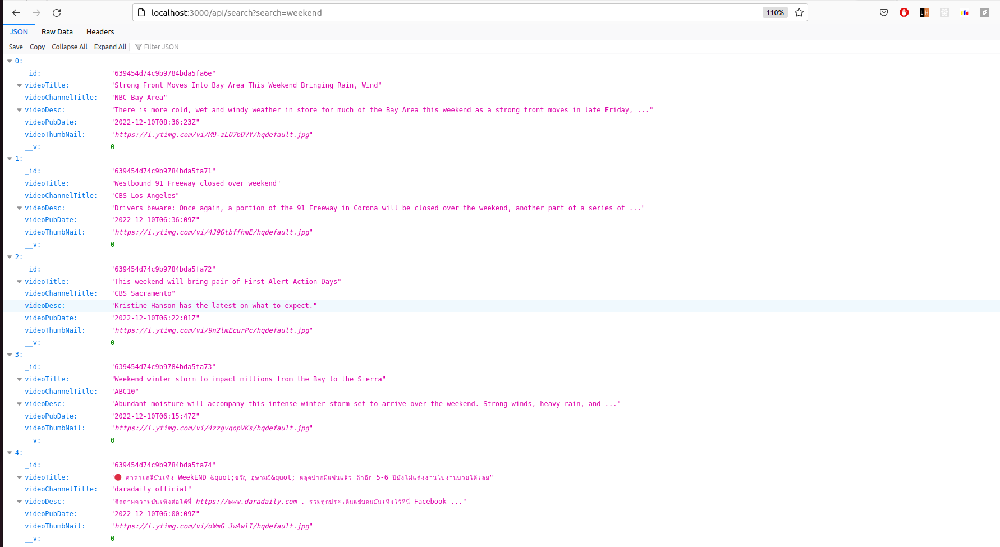
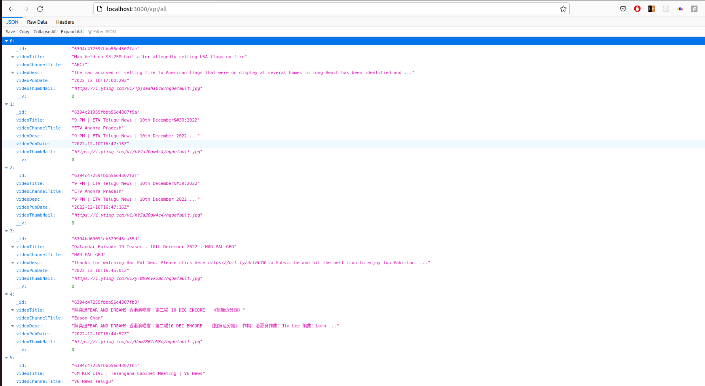
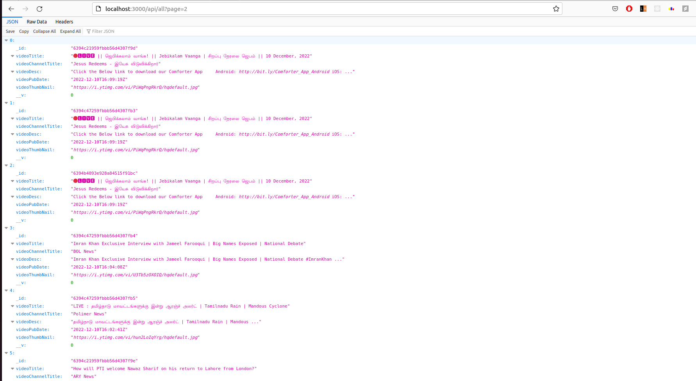

# MedBikri
MedBikri assesment pulling data from youtube api and sorting the data in reverse chronological order.

# Youtube Fetch Api
An API to fetch latest videos from youtube sorted in reverse chronological order of their publishing date-time from YouTube for a given tag/search query in a paginated response.

The server fetches latest videos async after every 10 minutes and saves it to the db.

This project is completely based on Node, Express and tailwind.

## Method Used

Used Cron Jobs [node-cron](https://www.npmjs.com/package/node-cron) to fetch videos after every 10 minutes using [Youtube Data Api](https://developers.google.com/youtube/v3/docs/search/list) and save it to the db

## Setup Guide
- Clone the project
- As this project is based on Node.js, your system need to have proper node setup, refer [this](https://nodejs.org/en/docs/)
- Go the project through the terminal and install all dependencies by using typing `npm install` in the terminal
- Inside the `.env` file, fill the variable `GOOGLE_API_KEYS` with all the API Keys available,the list should be filled as `APIKEY1= "EXAMPLE1" APIKEY2="EXAMPLE2"` etc...
- For getting an API key follow [this](https://developers.google.com/youtube/v3/getting-started)
- Setup crontab to run Job, Follow [this](https://www.npmjs.com/package/node-cron)
- Run the server using `npm start`

## Screenshots

For visualization through a dashboard one may directly run the app locally and the get the UI provided through dist folder containing the output.css

### HomePage

### Searching filter Data

### Data Searched with the query

### Data Searched with empty query

### Data Searched without query gives all the data to the user

### Also can query using "page" query since the data is sorted in reverse chronological order it skeps   ### the first some data to get to page number for example 2...
